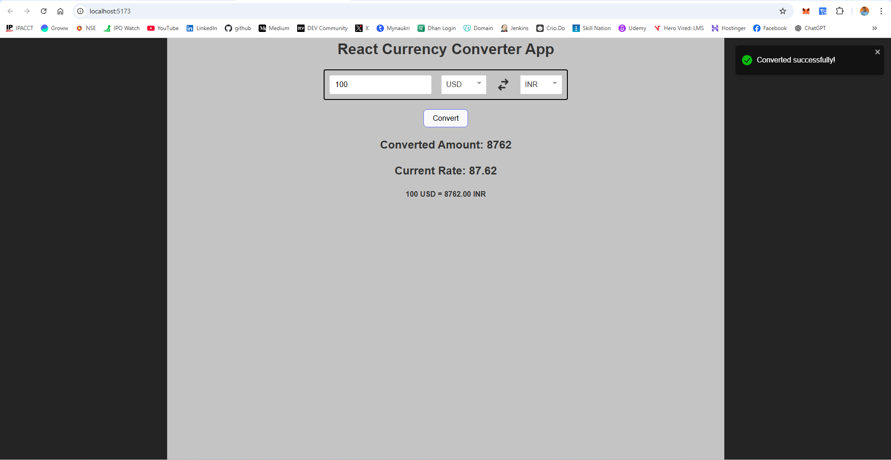

# 💱 React Currency Converter App

A responsive, interactive currency converter built using **React**, powered by **ExchangeRate-API**, with user-friendly UI enhancements including loading spinners and toast notifications.

<!-- 🌐 [Live Demo](https://your-vercel-deployment-link.vercel.app/)  -->

---

## 🚀 Features

- 🔄 Convert currencies instantly between multiple world currencies
- 📡 Real-time exchange rates using [ExchangeRate-API](https://www.exchangerate-api.com/)
- 🎛️ Intuitive dropdown selectors for "From" and "To" currencies
- 🧮 Dynamic conversion result display
- 🟢 Loading spinner using `react-loader-spinner`
- 🔔 Clean toast notifications using `react-toastify`
- 🔁 Currency switch icon to swap currencies
- 💡 Input validation with helpful feedback

---

## 🛠️ Tech Stack

- [React](https://reactjs.org/)
- [Axios](https://axios-http.com/)
- [ExchangeRate-API](https://www.exchangerate-api.com/)
- [React Toastify](https://fkhadra.github.io/react-toastify/)
- [React Loader Spinner](https://www.npmjs.com/package/react-loader-spinner)
- [React Dropdown](https://www.npmjs.com/package/react-dropdown)
- [React Icons](https://react-icons.github.io/react-icons/)

---

## 📸 Screenshots

| Desktop | Mobile | Result |
|------|---------|--------|
|  |  |  |

---

## 🧩 Getting Started

### 1. Clone Repository

```bash
git clone https://github.com/surendergupta/react-currency-converter-app.git
cd react-currency-converter-app
```

### 2. Install Dependencies

```bash
npm install
```

### 3. Run Development Server

```bash
npm run dev
```
Then visit: http://localhost:5173

---


## 📁 Project Structure
```bash
├── public
├── src
│   ├── App.jsx
│   ├── App.css
│   ├── index.js
│   └── Components/
├── package.json
└── README.md
```

---

## ⚙️ Configuration
No API key required — it uses the free ExchangeRate-API public endpoint.

---

## 🧪 To Do (Enhancements)
- Add conversion history
- Dark mode toggle
- Save last used currencies to localStorage
- Add currency symbols (€, $, ₹) in UI
- Unit tests with Jest

---

## 📜 License
This project is open source and available under the MIT License.

## 🙌 Acknowledgements
- ExchangeRate-API
- React Toastify
- React Loader Spinner

## 🙋‍♂️ Author
Made with ❤️ by [Surender Gupta](https://linkedin.com/in/surender-gupta)
Feel free to connect!